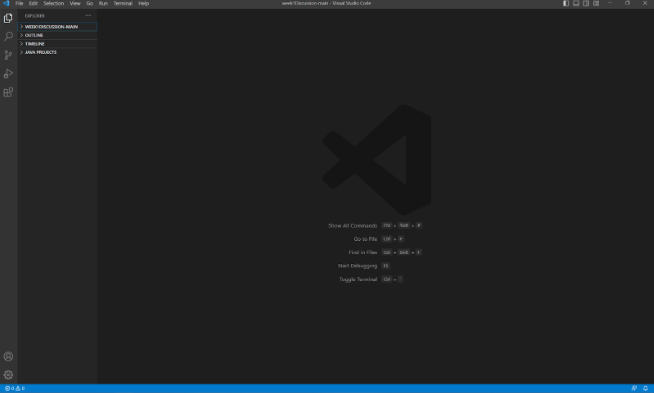

# Lab Report 1  
Welcome to coding! This first lab report will be talking about how to set up our programming environment.
## Account Setup  
We'll have to log into our course account into UCSD in order to remotely login and use the UCSD servers (ieng6).  
To do so, we'll want to find our course using the [course account lookup tool](https://sdacs.ucsd.edu/~icc/index.php).  
Search up your school username and PID, before finding your course account and resetting it.  
To reset, click on your course specific account, and follow the directions of the password reset listed on that screen.  
Please note that resetting the course password may take a while before the school servers record the new password.  

After setting up the account, we'll need to set-up our coding environment, which will be Visual Studio Code (VS Code).  
## VS Code Setup  
To start, we'll want to install the platform VS Code!  
This can be done from this [link](https://code.visualstudio.com/) where the installation steps are on the website.  
If the instructions were followed correctly, the starting screen for when VS Code is booted up should look as follows:  

## Remote Login  
  
  
## Trying Some Commands  
