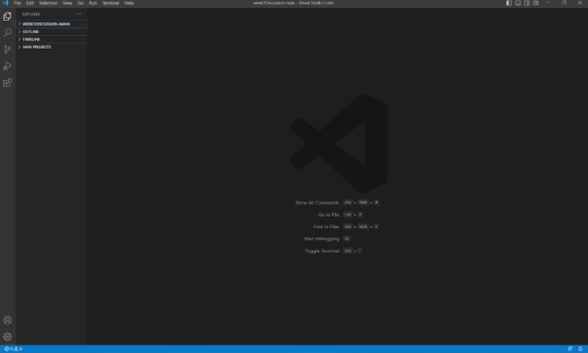
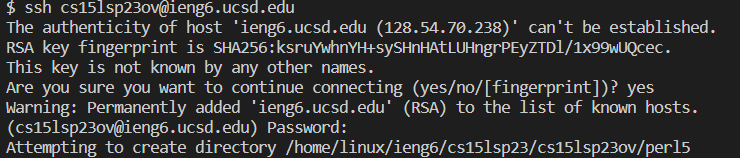
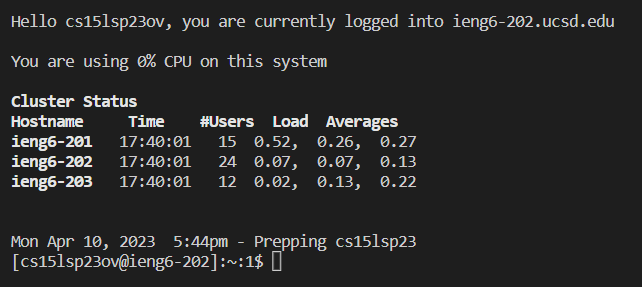
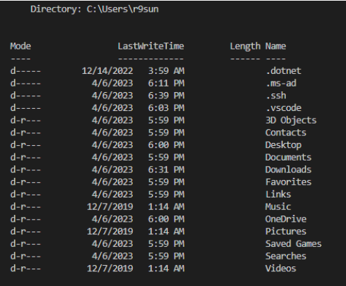

# Lab Report 1  
Welcome to coding! This first lab report will be talking about how to set up our programming environment.  
## Account Setup  
We'll have to log into our course account into UCSD in order to remotely login and use the UCSD servers (ieng6).  
To do so, we'll want to find our course using the [course account lookup tool](https://sdacs.ucsd.edu/~icc/index.php).  
Search up your school username and PID, before finding your course account and resetting it.  
To reset, click on your course specific account, and follow the directions of the password reset listed on that screen.  
Please note that resetting the course password may take a while before the school servers record the new password.  
  
  
After setting up the account, we'll need to set-up our coding environment, which will be Visual Studio Code (VS Code).  
## VS Code Setup  
To start, we'll want to install the platform VS Code!  
This can be done from this [link](https://code.visualstudio.com/) where the installation steps are on the website and relatively straightforward.  
If the instructions were followed correctly, the starting screen for when VS Code is booted up should look as follows:  
  

## Remote Login  
Once VS Code is setup, we may remotely log in to the UCSD servers using VS Code and our setup course account!  
First thing that will need to be done is an installation of git, found [here](https://gitforwindows.org/).  
After installation, git bash will need to be selected as the shell, which can be done by clicking the "+" button next to powershell.  
From then on, you can access the school servers by running the command  
```$ ssh cs15lsp23zz@ieng6.ucsd.edu```   
where the zz is replaced by the unique 2 letters assigned to you along with the course account if taken in a different class/time.  
Logging in for the first time you should see:  
  
Feel free to say "yes" and enter the remote server. After doing so, you will be prompted with entering your password which should be done.  
After all of it is done, your terminal should display:  
  
Congratulations! You have hacked into the UCSD servers!
  
## Trying Some Commands  
You can test some commands around in the server now. Try running $ ls, to see where you are and $ cd ~, where ~ is some file path.  
These commands are not limited to being run in ssh, and can be run generally in the normal terminal like such (The commands run as shown below are cd ~ and ls, where cd ~ returns to my computer's home directory, and ls shows what files are in there.)   
  
  
Following this, your account and workplace should be all setup to run some code!
Some basic commands to try are some of the aforementioned listed ones.
cd ~, standing for change directory, with ~ representing the file path to change to (leave as ~ if you want to just return to the home directory).   
ls ~, which shows the list of files in the ~ directory.  
cp ~ ~, which copies files over from the first ~ path to the second ~ path. (Make sure to separate the ~s to show 2 different paths!)  
cat ~ ~ ..., which concatenates and prints out the text from all the listed files into one giant text box.  
