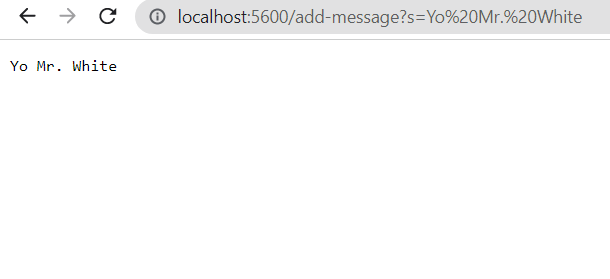
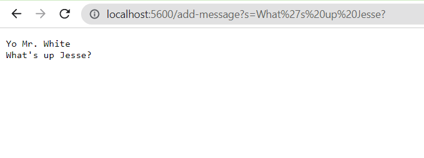
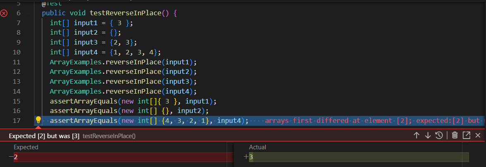
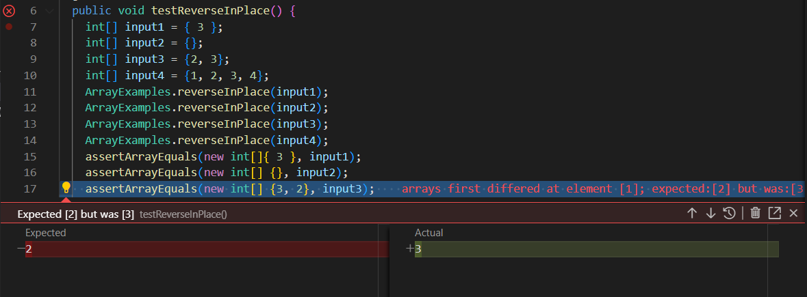
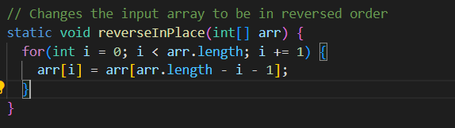
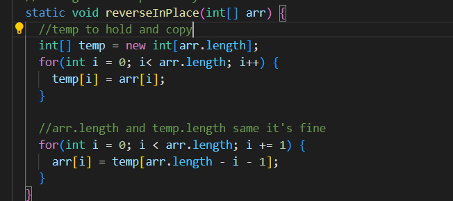

# Lab Report 2  
  
## Part 1  
For this string server task, I used the following code to complete the job:  
```  
class Handler implements URLHandler {
    // Foundation copied over from NumberServer
    String message = "";

    public String handleRequest(URI url) {
        if (url.getPath().contains("/add-message")) {
            String[] parameters = url.getQuery().split("=");
            String stringToPrint = parameters[1];
            message = message + stringToPrint + "\n";

        } 
        
        return String.format(message);
    }
}


public class StringServer {
    public static void main(String[] args) throws IOException {
        if(args.length == 0){
            System.out.println("Missing port number! Try any number between 1024 to 49151");
            return;
        }

        int port = Integer.parseInt(args[0]);

        Server.start(port, new Handler());
    }
}
```  
  
The following are a couple examples of the code working with answers below:  
  
In this example, the handleRequest method in the Handler class and the main method in the StringServer class were run.  
The relevant argument passed to the handler method is the URL link, minus the domain name.  
Since there was a valid query, the message to be displayed was updated with the information after the query.  
Now message, which was initially empty, contains "Yo Mr. White \n" as was added (except the newline,  
which is to be ready for the next command to be inserted).  
  
  
The handleRequest method in the Handler class and the main method in the StringServer class were run in this example too.  
The functionality was the same as described previously, except the query and message added this time was different, with  
the message being updated again to contain "Yo Mr. White \n What's up Jesse? \n".

## Part 2  
The bug for analysis here is the testReverseInPlace function for the ArrayExamples.  
For the first method, testReverseInPlace, a couple wrong inputs were:  
```
    int[] input3 = {2, 3};  
    ArrayExamples.reverseInPlace(input3);  
    assertArrayEquals(new int[] {3, 2}, input3);  
      
    int[] input4 = {1, 2, 3, 4};
    ArrayExamples.reverseInPlace(input4);
    assertArrayEquals(new int[] {4, 3, 2, 1}, input4);
```  
However, it did also work for inputs like:  
```
    int[] input2 = {};
    ArrayExamples.reverseInPlace(input2);
    assertArrayEquals(new int[] {}, input2);
```  
Here's the proof: (Note how the first two tests, the default and my added test work as no error message popped up on line 15 or 16)    
  
    

So what went wrong?  
It was an issue of copying the data into the array we also had the data in. This means that data in earlier elements data were lost when  
they were overriden and copied over by elements from the end of the array. This means that only number palindromes would've copied properly.  

Before Code:  
```  

```  
  
After Code:  
```  
static void reverseInPlace(int[] arr) {
    //Creating two temp numbers to hold
    //Then swapping their positions
    int pairOne;
    int pairTwo;
    for(int i = 0; i< arr.length; i++) {
      pairOne = i;
      pairTwo = arr.length - i;
      arr[i] = pairTwo;
      arr[arr.length - i] = pairOne;
    }

  }
 ```  
  

This temp solution works because it stores the original array in a separate, unchanging entity. This means we can safely and reliably  
copy the data over from the temp array into the original array to reverse the original array with the correct data.  
  
## Part 3  
One thing I learned through these most recent things from these past 2 labs was setting up servers!  
I did not know that my local computer could set up as a local server, and have its website and server be accessed by other people.  
It was a cool experience setting up the server and having people mess around with the limited counting functions on it.
