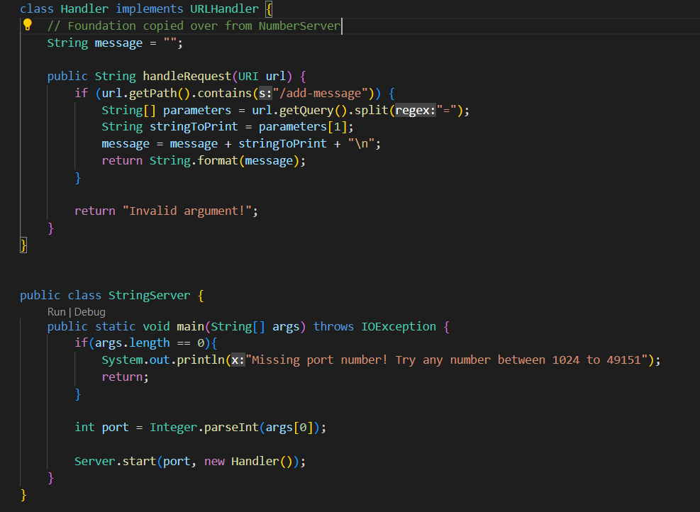

# Lab Report 2  
  
## Part 1  
For this string server task, I used the following code to complete the job:  
  
  
The following are a couple examples of the code working with answers below:  
  
In this example, the handleRequest method in the Handler class and the main method in the StringServer class were run.  
The relevant argument passed to the handler method is the URL link, minus the domain name.  
It breaks down the rest of the URL and only operates on the information given after the query.  
If the query is specific and valid, it reads whatever information is on 

  


## Part 2  
The bug for analysis here is the testReverseInPlace function for the ArrayExamples.  
For the first method, testReverseInPlace, a couple wrong inputs were:  
```
    int[] input3 = {2, 3};  
    ArrayExamples.reverseInPlace(input3);  
    assertArrayEquals(new int[] {3, 2}, input3);  
      
    int[] input4 = {1, 2, 3, 4};
    ArrayExamples.reverseInPlace(input4);
    assertArrayEquals(new int[] {4, 3, 2, 1}, input4);
```  
However, it did also work for inputs like:  
```
    int[] input2 = {};
    ArrayExamples.reverseInPlace(input2);
    assertArrayEquals(new int[] {}, input2);
```  
Here's the proof: (Note how the first two tests, the default and my added test work as no error message popped up on line 15 or 16)    
  
    

So what went wrong?  
It was an issue of copying the data into the array we also had the data in. This means that data in earlier elements data were lost when  
they were overriden and copied over by elements from the end of the array. This means that only number palindromes would've copied properly.  

Before Code:  
  
After Code:  
  

This temp solution works because it stores the original array in a separate, unchanging entity. This means we can safely and reliably  
copy the data over from the temp array into the original array to reverse the original array with the correct data.  
  
## Part 3  
One thing I learned through these most recent things from these past 2 labs was setting up servers!  
I did not know that my local computer could set up as a local server, and have its website and server be accessed by other people.  
It was a cool experience setting up the server and having people mess around with the limited counting functions on it.
