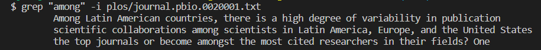
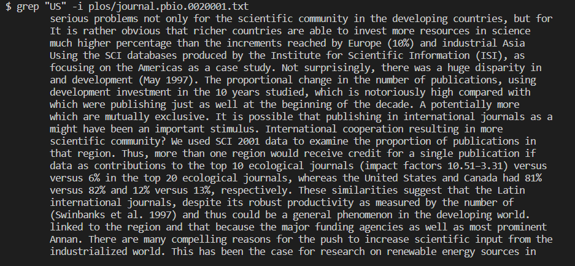

# Lab Report 3  
This lab report will be investigating the command grep, and certain functions and parts of that command.  
The commands we'll be looking at are the commands: -i, -n, -w, and -h.  

Note: The source for all the following commands was found using this [link](https://www.geeksforgeeks.org/grep-command-in-unixlinux/). Also the fact that these test are being run in the technical/ directory.  
  
-w flag: It is a command that prints the lines that match the argument passed only if that line has the whole word on it.
The following are examples showing the -w flag.  

  
-n flag: 
The following are examples showing the -n flag.

-h flag: 
The following are examples showing the -h flag.

-i flag: The -i means that when grep is looking to match lines, the case of the desired argument in the file being searched does not matter when printing. It enables the printing of lines that have the same characters and keywords/phrases matching, without woring about upper/lowercase.  
The following are examples showing the -i flag.  
Example 1-  
```  
Code: 
grep -i "among" plos/journal.pbio.0020001.txt
Output:
Among Latin American countries, there is a high degree of variability in publication
scientific collaborations among scientists in Latin America, Europe, and the United States
the top journals or become amongst the most cited researchers in their fields? One
```  
  
  
Example 2-  
```  
Code: 
grep "US" -i plos/journal.pbio.0020001.txt

Output:
serious problems not only for the scientific community in the developing countries, but for
It is rather obvious that richer countries are able to invest more resources in science
much higher percentage than the increments reached by Europe (10%) and industrial Asia
Using the SCI databases produced by the Institute for Scientific Information (ISI), as
focusing on the Americas as a case study. Not surprisingly, there was a huge disparity in
and development (May 1997). The proportional change in the number of publications, using
development investment in the 10 years studied, which is notoriously high compared with
which were publishing just as well at the beginning of the decade. A potentially more
which are mutually exclusive. It is possible that publishing in international journals as a
might have been an important stimulus. International cooperation resulting in more
scientific community? We used SCI 2001 data to examine the proportion of publications in
that region. Thus, more than one region would receive credit for a single publication if
data as contributions to the top 10 ecological journals (impact factors 10.51–3.31) versus
versus 6% in the top 20 ecological journals, whereas the United States and Canada had 81%
versus 82% and 12% versus 13%, respectively. These similarities suggest that the Latin
international journals, despite its robust productivity as measured by the number of
(Swinbanks et al. 1997) and thus could be a general phenomenon in the developing world.
linked to the region and that because the major funding agencies as well as most prominent
Annan. There are many compelling reasons for the push to increase scientific input from the
industrialized world. This has been the case for research on renewable energy sources in
```  
  
  
