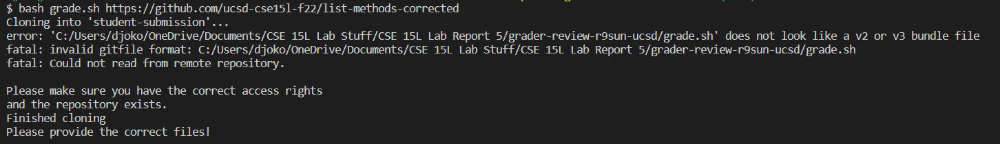
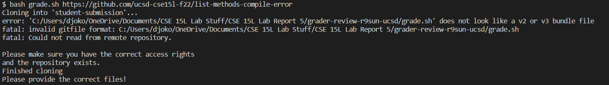
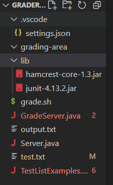
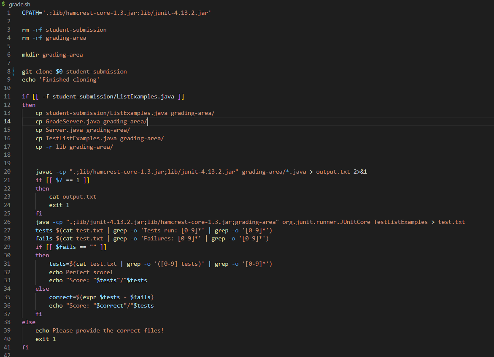

# Lab Report 5  
## Debugging Help  
  
Mock Post:  
What environment are you using (computer, operating system, web browser, terminal/editor, and so on)?  
I am currently attempting to do my grading script. I am currently using VS Code on my own computer, which is a Windows, trying to run my grade.sh script in bash!  
  
Detail the symptom you're seeing. Be specific; include both what you're seeing and what you expected to see instead. Screenshots are great, copy-pasted terminal output is also great. Avoid saying “it doesn't work”.  
The error output here is:  
  
The code should instead run properly, and return that all 5 tests were correct with 5/5 being returned. Here is the code I was running and using at the time.  
  
Detail the failure-inducing input and context. That might mean any or all of the command you're running, a test case, command-line arguments, working directory, even the last few commands you ran. Do your best to provide as much context as you can.  
I was just running my grade.sh file when this output happened, with the context shown in the screenshot given above. I was trying to test the correct output for my grading script on one of the repositories that should've returned a good score, but I got the error message as shown above.  
  
Mock TA Response:  
Hello! Do you mind telling me what specific code changed. That being said, why don't you try running the grading script on other files like the compiler error file to see where the issue lies within the code.
  
Second Student Response:  
Hello, I tried running the command on the output that should've failed and got the same error message!  
  
  
The error was that the git clone was running on git clone $0, and so was never properly cloning the URL that was passed in to the grading command! The command should've been git clone $1 in order to correctly parse the URL argument.  
  
In the end, the grading directory structure was this:  
  
  
The code before that contained the bug was:  
  
  
The command that triggered the error:  
```
bash grade.sh https://github.com/ucsd-cse15l-f22/list-methods-corrected
```  
The fix:  
A simple misunderstanding of the numbering of the arguments passed to it. $1 would give the first argument that wasn't the command bash, and so could properly run the command within the autograder script, while running $0 would confuse the grade script with the supposed "file" passed to it.  
  
## Reflection  
One of the things I enjoyed learning about this quarter was the creation of our own grading scripts. While definitely simplified, and one of the harder, more tedious labs, it was cool to see the real applications of this class. During the lab sections involving the autograder, I learned a bit more about bash and reviewed some commands like grep and whatnot, and how to apply them in bash to run the autograder script that would work and run a series of tests on code.  
